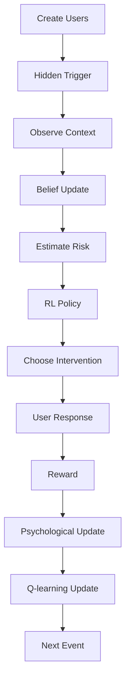

# Psychology-Informed Reinforcement Learning for Adaptive Behavior Change

A reinforcement learning framework that investigates how personalized digital interventions can support snus reduction under uncertainty.

The project combines **reinforcement learning**, **behavioral psychology**, and **hidden-state inference** to simulate adaptive behavior change in users with different addiction profiles. Rather than assuming full knowledge of the user's internal state, the recommender must infer hidden craving triggers from noisy contextual observations before selecting personalized interventions.

---

## Project Highlights

- Reinforcement Learning (Tabular Q-learning)
- Partially Observable Decision Making
- Hidden Trigger Inference
- Psychology-Based User Simulation
- Personalized Intervention Policies
- Human-Centered AI
- Behavioral Evaluation Framework

---

## Motivation

Digital behavior change applications face two difficult problems:

- **When** should an intervention be delivered?
- **Which** intervention should be delivered?

Most existing systems rely on static rules or predefined schedules. In reality, however, people differ in addiction severity, motivation, stress levels, daily routines, and responsiveness to interventions. Furthermore, the true reason behind a craving is rarely directly observable.

This project explores whether a reinforcement learning agent can learn adaptive intervention policies under these uncertainties while balancing intervention effectiveness against notification fatigue, disengagement, relapse, and long-term abstinence.

---

## System Overview

The recommender interacts with a simulated population of users.

```text
Hidden Trigger
        │
        ▼
Observed Context Signals
        │
        ▼
Belief State Update
        │
        ▼
Estimated Risk
        │
        ▼
RL Policy
        │
        ▼
Selected Intervention
        │
        ▼
User Response
        │
        ▼
Reward + Psychological Update
```

The system never observes the user's true craving trigger directly. Instead, it must infer likely triggers from noisy contextual signals before selecting an intervention.

---

# Features

## Psychology-Based User Model

Each simulated user maintains a dynamic psychological profile consisting of

- Addiction severity
- Motivation
- Self-efficacy
- Stress
- Craving
- Social pressure
- Intervention fatigue
- Abstinence state
- Relapse risk

These variables evolve continuously throughout the simulation.

---

## Hidden Trigger Model

Cravings originate from latent contextual triggers such as

- After meals
- Studying
- Alcohol-related situations
- Morning cravings
- Commuting
- Social gatherings
- Breaks between tasks

The recommender never observes these directly.

Instead it receives noisy contextual information and estimates the most likely trigger using a probabilistic belief state.

---

## Reinforcement Learning

The adaptive recommender uses **tabular Q-learning**.

### State

The state consists of

- User type
- Estimated trigger
- Estimated risk level
- Fatigue level
- Quitting strategy

### Actions

- No intervention
- Economic reminder
- Consumption feedback
- Small reduction goal

### Reward

Rewards encourage

- Skipping snus
- Delaying consumption
- Long-term self-regulation

while discouraging

- Excessive nudging
- Ignored interventions
- Continued consumption

---

## Baseline Comparison

The adaptive recommender is evaluated against a tracking-only baseline that contains

- No adaptive intervention policy
- No reinforcement learning
- Identical simulated users
- Identical craving dynamics

This enables direct comparison between adaptive and non-adaptive intervention strategies.

---

# Evaluation Metrics

The framework evaluates multiple dimensions of intervention quality.

Behavioral outcomes

- Daily snus consumption
- Abstinence
- Relapse
- Delay frequency

User engagement

- Intervention fatigue
- User retention
- Dropout rate

Algorithm performance

- Trigger inference accuracy
- Learned Q-values
- Average interventions per day

Economic outcomes

- Estimated money saved

---

# Example Visualizations

The framework generates figures including

- Daily consumption curves
- Baseline vs adaptive comparison
- User retention
- Fatigue over time
- Trigger inference confusion matrix
- Money saved
- Sustained abstinence

*(Example figures can be placed here.)*

---

# Project Structure

```
project/

├── config.py
├── user.py
├── simulation.py
├── evaluation.py
├── plots.py
├── utils.py
├── main.py
└── README.md
```

---

# Installation

Clone the repository

```bash
git clone https://github.com/USERNAME/repository.git
```

Install dependencies

```bash
pip install -r requirements.txt
```

Run the simulation

```bash
python main.py
```

---

# Methodology

The simulation proceeds as follows

1. Initialize simulated users
2. Assign psychological profiles
3. Generate hidden craving triggers
4. Observe noisy contextual signals
5. Estimate hidden trigger probabilities
6. Estimate current risk
7. Select intervention
8. Simulate user response
9. Update psychological state
10. Update Q-table (training only)
11. Evaluate outcomes

A detailed flowchart is available below.



---

# Technical Stack

- Python
- NumPy
- Pandas
- Matplotlib
- Reinforcement Learning
- Behavioral Simulation
- Hidden-State Modeling

---

# Future Work

Potential extensions include

- Deep Q-Networks
- Contextual Bandits
- Thompson Sampling
- Bayesian Reinforcement Learning
- Real smartphone sensor data
- Clinical validation
- Mobile application deployment

---

# Limitations

This project is intended as an exploratory simulation rather than a predictive clinical model.

Current limitations include

- Simulated behavioral data
- Simplified psychological dynamics
- Tabular reinforcement learning
- Manually designed reward function
- No real-world mobile sensing
- Parameters chosen for plausibility rather than clinical estimation

---

# Citation

If you use this project, please cite

Malcolm Söyring Helasterä

KTH Royal Institute of Technology

2026

---

# License

MIT License
