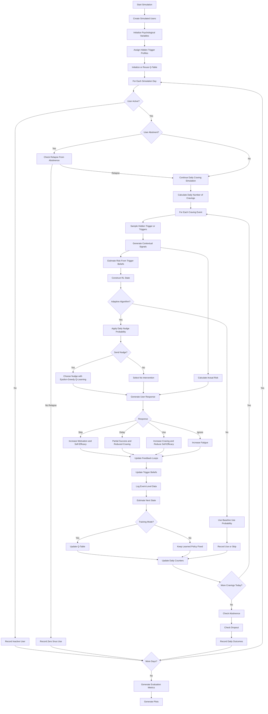

# Designing-Human-Centered-AI
Algorithmic Support

# Things to fix: 
* Add a deliberate nonstationary scenario for stronger evaluation
* Decide on final plots for the presentation/report
* Make quitting strategy assignment vary if cold turkey should be evaluated separately

# Psychology-Informed Reinforcement Learning for Adaptive Snus Reduction

## Overview

This project implements a psychology-informed adaptive recommender system designed to support snus reduction through personalized behavioral interventions.

The system is modeled as a partially observable reinforcement learning problem where the true causes of cravings are hidden from the algorithm. Instead of directly observing a user's trigger, the system receives noisy contextual observations and must infer likely triggers over time.

The goal is to investigate how reinforcement learning, behavioral psychology, and hidden-state inference can be combined to support behavior change while balancing intervention effectiveness against user fatigue, dropout, relapse, and long-term abstinence.

---

## Research Motivation

Digital health interventions often face two key challenges:

1. Determining the right moment to intervene.
2. Determining the right intervention for a particular user.

In practice, users have different addiction levels, motivations, triggers, fatigue levels, and responses to interventions. Furthermore, many triggers are not directly observable.

This project explores whether an adaptive reinforcement learning system can learn personalized intervention strategies under uncertainty.

---

## Project Structure

```text
project/
│
├── main.py
├── config.py
├── user.py
├── simulation.py
├── evaluation.py
├── plots.py
├── utils.py
└── README.md
```

### `config.py`

Contains:

- User group definitions
- Trigger definitions
- Context risk values
- Observable signal definitions
- Context signal model
- Q-learning parameters
- Reward function
- Intervention definitions
- Cost per snus portion

### `user.py`

Contains:

- User psychological model
- Hidden trigger profile
- Context signal observation
- Trigger belief updates
- Actual and estimated risk calculation
- Nudge response generation
- Feedback loop updates
- Q-learning updates
- Abstinence and relapse behavior
- Dropout behavior

### `simulation.py`

Contains:

- Main simulation loop
- Training and evaluation modes
- Daily craving generation
- Baseline condition
- Adaptive intervention condition
- Event-level logging
- Daily outcome tracking

### `evaluation.py`

Contains:

- Summary statistics
- Dropout and money-saved evaluation
- Trigger inference accuracy
- Q-value inspection

### `plots.py`

Contains:

- Visualization functions for consumption, retention, fatigue, money saved, trigger inference, and sustained abstinence

### `utils.py`

Contains:

- State discretization
- Hidden trigger generation

---

## User Groups

The simulation models four user populations:

### High Relapse Risk / High Intake

- High addiction
- High stress
- Low self-efficacy
- High baseline snus use

### High Relapse Risk / Low Intake

- Lower consumption
- High stress
- Vulnerable to relapse

### Low Relapse Risk / High Intake

- High consumption
- Stronger motivation
- Stronger self-efficacy

### Low Relapse Risk / Low Intake

- Low consumption
- Low addiction
- High motivation

Each group is initialized using different psychological profiles.

---

## Hidden Trigger Model

The simulation assumes that cravings arise from hidden contextual triggers.

Possible triggers:

- `after_meal`
- `studying`
- `alcohol_context`
- `morning_craving`
- `sleeping`
- `commuting`
- `break_between_tasks`
- `friends_hangout`

Each user receives a hidden trigger profile generated from a probability distribution. This profile determines how likely different contexts are to cause cravings for that specific user.

During each craving event, the simulator samples either one trigger or two simultaneous triggers.

The true trigger is never directly observed by the recommender.

---

## Observation Model

The application does not directly observe the user's true trigger.

Instead, it receives noisy contextual observations generated by an observation model.

Observable signals include:

- `time_of_day`
- `location_type`
- `time_since_meal`
- `day_type`
- `movement_level`
- `phone_activity`

Example:

```text
True trigger:
alcohol_context

Observed signals:
time_of_day: evening
location_type: bar
day_type: weekend
movement_level: walking
phone_activity: high
```

This reflects the uncertainty faced by real-world digital health systems using phone-based contextual signals.

The observation model intentionally makes some contexts partially overlapping. For example, alcohol contexts and friend hangouts can both occur in the evening, while studying and breaks between tasks can both occur at university.

---

## Belief State and Trigger Inference

The system maintains a probability distribution over possible triggers.

Example:

```text
studying:             0.40
after_meal:           0.22
break_between_tasks:  0.18
commuting:            0.10
other:                0.10
```

As observations arrive, trigger beliefs are updated using the likelihood of the observed signals under each possible context.

The trigger with the highest probability becomes the system's inferred trigger.

The model also stores trigger confidence, which is the probability assigned to the most likely trigger.

---

## Actual Risk vs Estimated Risk

The simulation separates:

### Actual Risk

The user's true risk of using snus during a craving event.

Actual risk depends on:

- Addiction
- Stress
- Craving
- Social pressure
- Fatigue
- Hidden trigger risk
- Quitting strategy
- Previous successes

Actual risk determines user behavior.

### Estimated Risk

The recommender's estimate of the user's risk.

Estimated risk depends on:

- Current trigger beliefs
- Expected trigger risk
- Psychological variables
- Quitting strategy
- Previous successes

The recommender only has access to estimated risk when choosing interventions.

This creates a simplified partially observable decision-making problem.

---

## Intervention Strategies

The recommender can choose between:

- `no_intervention`
- `economic reminder`
- `snus_consumption_feedback`
- `small_reduction_goal`

### No Intervention

Included as a valid action because excessive nudging can increase fatigue and dropout.

The system can therefore learn that sometimes the best intervention is not intervening.

The simulation also limits intervention burden by reducing the probability of sending additional nudges after several have already been sent during the same day.

---

## Quitting Strategies

The user model contains logic for two cessation strategies.

### Cold Turkey

The user attempts to stop immediately.

Characteristics:

- Higher early relapse risk
- Greater variability
- Potentially stronger long-term benefits after early success

### Gradual Reduction

The user reduces consumption incrementally.

Characteristics:

- Lower early relapse risk
- More stable behavior change
- Slower long-term improvement

The current simulation initializes users with `gradual_reduction` by default. The code still contains cold turkey dynamics, but cold turkey must be assigned to some users if both strategies should be compared in the final evaluation.

---

## Psychological Variables

Each user maintains:

- Motivation
- Addiction severity
- Stress
- Adherence
- Self-efficacy
- Craving
- Social pressure
- Intervention fatigue
- Success streak
- Total successes
- Active/dropout status
- Abstinent status

These variables evolve over time based on user behavior and intervention outcomes.

For example:

- Skipping snus increases motivation and self-efficacy.
- Delaying snus is treated as a partial success.
- Using snus can reduce self-efficacy and increase craving.
- Ignoring nudges increases intervention fatigue.

---

## Intervention Fatigue and Dropout

Repeated interventions can increase fatigue.

Fatigue increases when:

- Nudges are ignored
- Too many interventions are delivered in one day

Higher fatigue increases the probability of:

- Disengagement
- User dropout

This models notification fatigue commonly observed in digital health applications.

---

## Abstinence and Relapse

The simulation now includes explicit abstinence and relapse dynamics.

A user can become abstinent when daily snus use becomes very low, especially if the user has:

- High motivation
- High self-efficacy
- Lower addiction
- Lower stress
- Low fatigue
- Strong reduction compared to baseline

Abstinent users record zero snus use, but they can still relapse.

Relapse probability increases with:

- Addiction
- Stress
- Craving

Relapse probability decreases with:

- Self-efficacy

This allows the model to evaluate not only short-term reduction but also sustained abstinence.

---

## Reinforcement Learning

The recommender uses tabular Q-learning.

### State Representation

A state consists of:

- User type
- Inferred trigger
- Estimated risk level
- Fatigue level
- Quitting strategy

### Available Actions

- `no_intervention`
- `economic reminder`
- `snus_consumption_feedback`
- `small_reduction_goal`

### Reward Function

| Response | Reward |
|-----------|---------|
| Skip | +3 |
| Delay | +1.5 |
| Use | -0.5 |
| Ignore | -1 |

The Q-table learns which interventions work best for different situations.

The implementation also adjusts rewards for `no_intervention` so that successful self-regulation without intervention can be rewarded, while snus use without intervention is penalized.

---

## Exploration Strategy

The system uses epsilon-greedy exploration.

During training:

- Exploration starts at 60%
- Exploration gradually decreases to 5%
- The system increasingly exploits learned knowledge

During evaluation:

- Exploration is disabled
- The learned policy is used directly

---

## Economic Feedback

The simulation estimates money saved relative to baseline consumption.

Example:

```text
Baseline: 10 portions/day
Current: 5 portions/day

Savings:
5 avoided portions/day
```

Money saved is calculated using the estimated cost per snus portion.

This allows the model to evaluate both behavioral and economic outcomes.

---

## Evaluation Metrics

The simulation compares:

### Tracking-Only Baseline

No adaptive interventions.

Users still experience cravings, risk, abstinence, relapse, and dropout, but no recommender chooses nudges.

### Adaptive Recommender

Q-learning-based personalized intervention system.

The Q-table is first trained on a larger simulated population and then evaluated on unseen users with exploration disabled.

Metrics include:

- Snus reduction
- Dropout rate
- Average nudges per user/day
- Skips, delays, ignores
- Intervention fatigue
- Self-efficacy
- Money saved
- Trigger inference accuracy
- Sustained abstinence

---

## Visualizations

### Core Evaluation Plots

- Average daily snus use: baseline vs adaptive recommender
- Adaptive recommender effect by user type
- User retention by user type
- Retention by quitting strategy
- Intervention fatigue by user type
- Cumulative money saved by user type
- Event-level trigger inference confusion matrix
- Sustained abstinence by user type

### Additional Analysis

- Random learned Q-values
- Event-level trigger inference accuracy
- Daily summary statistics for baseline and adaptive conditions

---

## Running the Simulation

Install dependencies:

```bash
pip install numpy pandas matplotlib
```

Run:

```bash
python main.py
```

The main file:

1. Clears the existing Q-table.
2. Trains the adaptive recommender on simulated users.
3. Evaluates the learned adaptive policy.
4. Evaluates the tracking-only baseline.
5. Prints summary statistics and Q-values.
6. Generates all plots.

---

## Algorithm Flowchart



---

## Limitations

This simulation is intended as an exploratory model rather than a predictive clinical tool.

Limitations include:

- Simulated rather than real behavioral data
- Hand-designed reward structure
- Simplified psychological mechanisms
- Simplified trigger inference
- No real sensor or mobile application data
- Parameters calibrated for plausibility rather than estimated from empirical snus cessation datasets
- Quitting strategy comparison requires assigning different strategies to users
- Nonstationarity is present through changing user states, but could be evaluated more explicitly with a deliberate change in stress, craving, or routine during the simulation

Despite these limitations, the project demonstrates how reinforcement learning, behavioral theory, and hidden-state inference can be combined to model adaptive behavior-change support systems.
